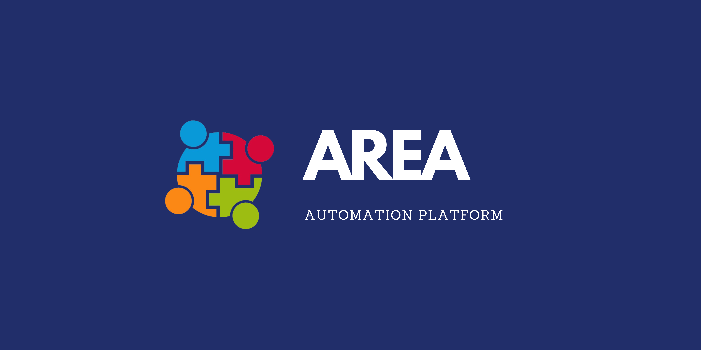

# Action-REAction 🌐⚙️📱



Welcome to the **Action-REAction** project! This project involves creating an automation platform inspired by tools like [IFTTT](https://ifttt.com) and [Zapier](https://zapier.com). The application enables users to connect various actions to reactions through "zones" called AREA.

## 🎯 Objective

Develop a software suite consisting of:

1. **Application Server**: Implements all business logic (backend).
2. **Web Client**: User interface accessible via a browser.
3. **Mobile Client**: User interface accessible via a smartphone.

The REST API server manages all processes, while the web and mobile clients only display data and forward requests.

---

## 🚀 Features

- User registration and authentication (via OAuth2 or password).
- User management and administration.
- Subscription to third-party services (Google, Facebook, etc.).
- Creation of AREA zones linking actions to reactions.
- Management of triggers to automate actions.

### 🔄 What is an AREA?

An AREA is a combination of an **Action** and a **Reaction**. When a specific action is detected, it triggers the corresponding reaction.

#### Examples:

- **Gmail / OneDrive**:
  - Action: A received email containing an attachment.
  - Reaction: The attachment is stored in a directory in OneDrive.

- **GitHub / Teams**:
  - Action: An issue is created on a repository.
  - Reaction: A message is sent on Teams.

---

## 📚 Tech Stack

This project uses the following technologies:

- **Node.js (Express)** for the back-end 
- **MongoDB** for the database 
- **ReactJS** for the web front-end 
- **Flutter** for the mobile client 
- **Azure** for the hosting 

---

## 🛠️ Setup with Docker Compose

The project includes three main services configured via `docker-compose`:

- `server`: Application server (port 8080).
- `client_web`: Web client (port 8081).
- `client_mobile`: Mobile client.

### Commands

- **Build services**: `docker-compose build`
- **Run services**: `docker-compose up`

### Notes:

- `client_web` depends on `client_mobile` and `server`.
- `client_web` and `client_mobile` share a common volume.
- The `server` service exposes metadata at `http://localhost:8080/about.json`.

---

## 📄 about.json File

The `server` exposes metadata about the application and available services via the `/about.json` endpoint.

### Example Response:

```json
{
  "client": {
    "host": "10.101.53.35"
  },
  "server": {
    "current_time": 1531680780,
    "services": [{
      "name": "facebook",
      "actions": [{
        "name": "new_message_in_group",
        "description": "A new message is posted in the group"
      }],
      "reactions": [{
        "name": "like_message",
        "description": "The user likes a message"
      }]
    }]
  }
}
```

---

## 📅 Project Milestones

1. **Planning**:
   - Research and choose the best tech stack.
   - Plan tasks and timelines.
   - Create a Proof of Concept (PoC).

2. **Minimum Viable Product (MVP)**:
   - Core architecture and basic functionalities implemented.

3. **Final Product**:
   - Complete application with features, good UI/UX, and deployment.

---

## 📖 Documentation

For detailed information about the project, please visit the [Documentation](docs/). 📚

---

## 🔗 Contributions

For contribution guidelines and setup instructions, please refer to the [Contributing Guide](docs/CONTRIBUTING.md). 🙌

---

## ✨ Authors

- [Aimeric Rouyer](https://github.com/aimericdrk)
- [Julien Renard](https://github.com/Neiluge)
- [Baptiste Moreau](https://github.com/BxptisteM)
- [Klayni Milandou](https://github.com/Klayni)

